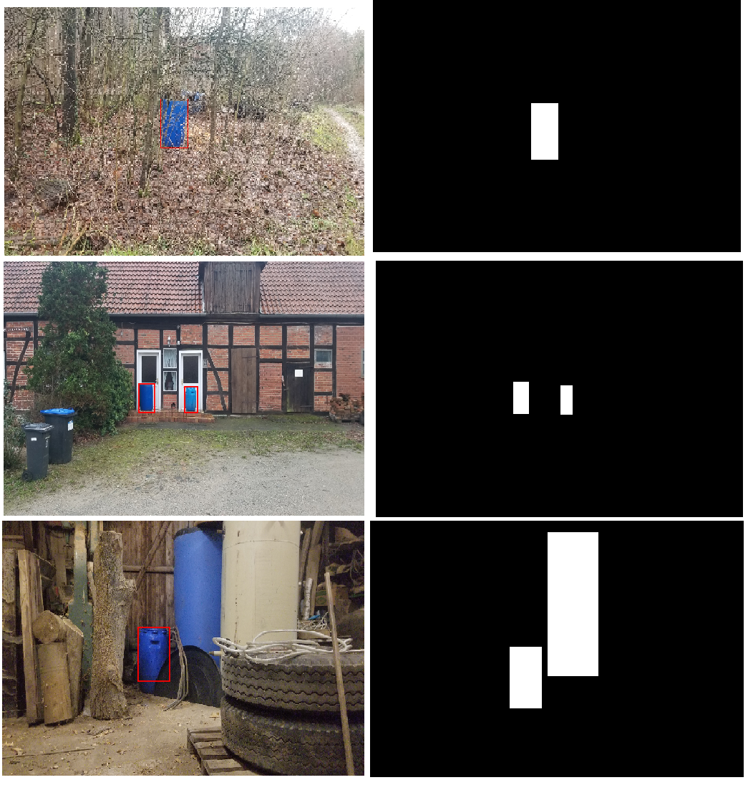

# Barrel-Detection

### barrel_detector_test.py

- Contains the functions for segment_image and get_bounding_box that returns binary segmented image and an image with bounding box around the detected blue-barrel regions respectively. 

### barrel_detector_train.py

Used for annotating images, learning weights and bias for the logistic regression model.
 
**Bool variables**:

create_labels -> If True, Annotation process begins, calls the function 'annotate'
train -> Begins training the logistic regression model (parameters initialized using normal distribution)

If train == True, 'log_reg' method is called that computes the gradients and update weights and biases 

*Excel file, 'Training Loss per Epoch' contains.....Training Loss per Epoch*

*weights1.np and bias1.np are the learned weights and bias for the model*

